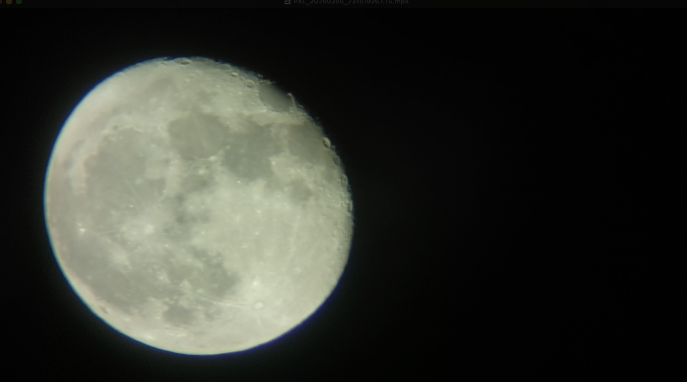
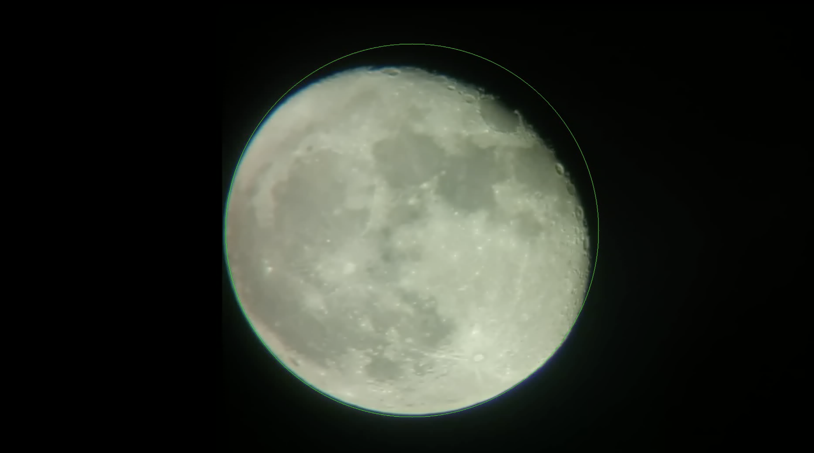
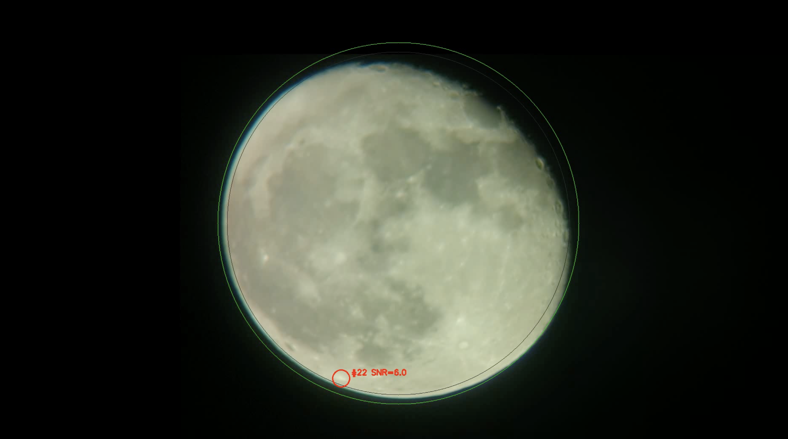

# TLP Detector

Offline detector for **Transient Lunar Phenomena (TLPs)** — brief, localised bright flashes on the lunar surface caused by meteoroid or asteroid impacts. Takes a handheld or telescope-mounted video of the moon and outputs a list of candidate flash events with timestamps, positions, and brightness scores.

---

## Scope

The pipeline handles the specific challenges of amateur telescope footage:

- The moon **drifts** across the frame and is periodically re-centred by the observer.
- **Atmospheric seeing** causes the whole disk to jitter by a few pixels between frames, creating false-positive artefacts at crater edges.
- Real flashes are **small** (1–5 pixels), **brief** (1–10 frames), and **much brighter** than the jitter noise.

The pipeline does **not** currently handle:
- Multiple moons or planets in frame
- Very fast (single-frame) cosmic ray events (intentionally filtered out)
- Infrared or non-visible-spectrum video
- Real-time / live processing (offline batch only)

---

## Demo

| Raw video | Stabilised (moon-locked) | TLP detection |
|:-:|:-:|:-:|
|  |  |  |

---

## Quick Start

Requires **Python 3.10+**.

```bash
pip install -r requirements.txt
```

### Run the full pipeline in one command

```bash
python run_pipeline.py video.mp4 --start 2 --end 10
```

`--start` and `--end` trim the video to a time range in seconds (here, 2 s to 10 s). This is useful for skipping shaky intro footage or processing only a segment of interest. Omit both to process the entire video.

This registers the video and detects flashes in one go. Outputs:
- `registered.mp4` — stabilised video (moon locked to center)
- `registered.json` — auto-detected moon geometry (center and radius), used by downstream scripts
- `detections.mp4` — annotated video with candidate event circles
- `events.json` — machine-readable event list

To lower the detection threshold and see more candidates:

```bash
python run_pipeline.py video.mp4 --start 2 --end 10 --min-residual 20
```

Optionally, generate a compact review video with zoomed-in clips of each detected event:

```bash
python make_events_video.py
```

### Run steps individually (for debugging / tuning)

```bash
# Step 1 — register frames (stabilise the moon)
python register_frames.py video.mp4 --start 2 --end 10 --output registered.mp4

# Step 2 (optional diagnostic) — inspect the residual signal
python background_subtract.py registered.mp4 --output residual.mp4

# Step 3 — detect flashes
python detect_flashes.py registered.mp4 --output detections.mp4 --events events.json
```

Open each output video to verify the stage before proceeding to the next.

---

## Scripts

### `run_pipeline.py` — Full pipeline

Chains registration and flash detection into a single command.

```
python run_pipeline.py <input> [options]
```

| Argument | Default | Description |
|---|---|---|
| `input` | — | Input video file |
| `--start` | `0.0` | Start time in seconds |
| `--end` | `-1` | End time in seconds (`-1` = until end) |
| `--registered` | `registered.mp4` | Path for intermediate registered video |
| `--output` | `detections.mp4` | Annotated detections video |
| `--events` | `events.json` | Events JSON |
| `--min-residual` | `30.0` | Hard minimum residual in DN (main sensitivity knob — see below) |

All other `detect_flashes.py` arguments (`--sigma-k`, `--min-area`, `--max-area`, `--min-frames`, `--max-frames`, `--link-radius`, `--half-window`) are also accepted and passed through to the detector.

---

### `register_frames.py` — Registration

Two-stage registration that warps each frame so the moon sits at the center of the frame with a fixed radius. The target center and radius are **auto-detected** from the video (center = frame midpoint, radius = median of RANSAC-fitted radii across all frames). A geometry sidecar JSON is written alongside the output video for use by downstream scripts.

```
python register_frames.py <input> [options]
```

| Argument | Default | Description |
|---|---|---|
| `input` | — | Raw input video |
| `--output` | `registered.mp4` | Stabilised output video |
| `--start` | `0.0` | Start time in seconds |
| `--end` | `-1` | End time in seconds |

**Stage 1 — Coarse (RANSAC circle fit):** Fits a circle to the lunar limb using RANSAC, which treats the terminator (the day/night boundary, which is *not* part of the geometric circle) as outliers. Detection parameters are then median-smoothed over ±5 frames to suppress per-frame fitting noise. A similarity transform (translate + uniform scale) maps the detected circle to the auto-computed target (frame center, median detected radius). All image-processing kernel sizes (blur, morphology, RANSAC inlier threshold) scale automatically with frame resolution.

**Stage 2 — Fine (phase correlation):** After coarse alignment, residual jitter of ±1–2 px remains from seeing. Phase correlation between each coarse-registered frame and a median reference image corrects this to sub-pixel accuracy. A Hanning window is applied before the FFT to reduce spectral leakage at the crop boundary.

**What to check:** Surface features (craters, maria) should stay largely still across the clip. Small residual jitter (< 1 px) is normal atmospheric seeing and cannot be fully corrected without distorting the image.

---

### `background_subtract.py` — Background subtraction (diagnostic)

Computes the temporal median background and displays the signed residual as a false-colour video. Useful for understanding the noise floor before tuning the detector.

```
python background_subtract.py <registered_video> [options]
```

| Argument | Default | Description |
|---|---|---|
| `input` | — | Registered video |
| `--output` | `residual.mp4` | False-colour residual video |
| `--start` | `0.0` | Start time |
| `--end` | `-1` | End time |
| `--half-window` | `15` | Frames each side of current frame used for median (±0.5 s at 30 fps) |
| `--moon-cx` | auto | Override moon center X (auto-loaded from geometry sidecar if omitted) |
| `--moon-cy` | auto | Override moon center Y |
| `--moon-radius` | auto | Override moon radius |

The output is mapped so that background = dim purple, brighter than background = warm yellow/white, dimmer than background = dark. The green circle marks the eroded analysis mask boundary (5% inward from the detected limb).

**What to check:** The residual should look mostly uniform noise. Bright/dark paired arcs at crater rims are expected seeing-jitter artefacts. The peak residual stat printed at the end tells you the jitter noise ceiling — use this to calibrate `--min-residual` in step 4.

---

### `detect_flashes.py` — Flash detection

The main detector. Reads the registered video, computes the same temporal median background internally, and outputs an annotated video and a JSON event list.

```
python detect_flashes.py <registered_video> [options]
```

| Argument | Default | Description |
|---|---|---|
| `input` | — | Registered video (output of step 2) |
| `--output` | `detections.mp4` | Annotated video with event circles |
| `--events` | `events.json` | JSON file with per-event metadata |
| `--start` | `0.0` | Start time in seconds |
| `--end` | `-1` | End time in seconds |
| `--half-window` | `15` | Background median half-window (frames) |
| `--sigma-k` | `5.0` | Relative threshold: detection requires `residual > k × σ` |
| `--min-residual` | `30.0` | Absolute threshold in DN — hard floor regardless of σ. Set just above your observed jitter noise ceiling (check `background_subtract.py` output) |
| `--min-area` | `2` | Minimum blob size in pixels |
| `--max-area` | `150` | Maximum blob size in pixels |
| `--min-frames` | `2` | Minimum consecutive frames to count as an event (rejects single-frame cosmic rays) |
| `--max-frames` | `30` | Maximum event duration in frames (~1 s at 30 fps) |
| `--link-radius` | `12` | Spatial radius in pixels to link detections across frames into one event |
| `--moon-cx` | auto | Override moon center X (auto-loaded from geometry sidecar if omitted) |
| `--moon-cy` | auto | Override moon center Y |
| `--moon-radius` | auto | Override moon radius |

#### Threshold calibration

The detector applies `threshold = max(sigma_k × σ, min_residual)`, meaning **both** conditions must be exceeded:

- `sigma_k × σ` adapts per-frame: on jittery frames σ rises and the bar rises with it.
- `min_residual` is a hard DN floor that prevents over-triggering on quiet frames.

**Recommended workflow:**
1. Run `background_subtract.py` and note the printed `max` residual (the jitter ceiling).
2. Set `--min-residual` to that value + 5–10 DN.
3. Adjust `--sigma-k` if needed: lower = more sensitive, higher = fewer false positives.

A real impact flash will be tens to hundreds of DN brighter than background, well above typical jitter noise of 20–30 DN.

#### `events.json` schema

```json
[
  {
    "event_id": 1,
    "start_frame": 48,
    "end_frame": 49,
    "duration_frames": 2,
    "cx": 857.3,          // pixel x in registered frame
    "cy": 172.8,          // pixel y in registered frame
    "peak_snr": 19.0,     // peak (residual / sigma) across all detections
    "start_time_s": 1.60,
    "end_time_s": 1.63,
    "lunar_x": -102.7,    // cx - moon_cx (offset from moon center, px)
    "lunar_y": -367.2,    // cy - moon_cy
    "detections": [...]   // per-frame detail
  }
]
```

`lunar_x` / `lunar_y` are in registered-frame pixels relative to the auto-detected moon center. Positive x = right (lunar east limb direction), positive y = down (lunar south limb direction).

---

### `make_events_video.py` — Event review

Post-processing utility that builds a compact review video from the pipeline output. For each event in `events.json`, it extracts a zoomed-in, time-padded clip from `detections.mp4` with a title card, then concatenates all clips into one video for easy triage.

```
python make_events_video.py [options]
```

| Argument | Default | Description |
|---|---|---|
| `--events` | `events.json` | Events JSON (output of pipeline) |
| `--input` | `detections.mp4` | Annotated video (output of pipeline) |
| `--output` | `review.mp4` | Concatenated review video |
| `--pad` | `2.0` | Seconds of context before/after each event |
| `--zoom` | `10` | Zoom factor for the crop around the event |

---

## Key Design Choices and Motivation

### Why temporal median for background?

The median of N frames suppresses any signal present in fewer than N/2 frames — which is exactly the property we want. A flash lasting 2–5 frames in a 31-frame window contributes to only ~10–15% of the window, so the median ignores it entirely and models only the stable surface. A mean would be pulled toward the flash.

The current frame is excluded from the background window so a single-frame flash does not partially cancel itself.

### Why two-stage registration?

**Coarse (RANSAC):** Simple contour fitting with `minEnclosingCircle` produces a circle that fits the convex hull of the binary disk, which is biased outward by the terminator and any bright limb pixels. RANSAC explicitly models the terminator as outliers and recovers the true geometric circle. A least-squares refinement on RANSAC inliers gives sub-pixel accuracy for the coarse stage.

**Fine (phase correlation):** After coarse alignment, atmospheric seeing causes residual jitter of ±1–3 pixels that RANSAC cannot correct (seeing affects the image content, not just the disk boundary). Phase correlation between each frame and a median reference image measures this residual shift to sub-pixel accuracy and corrects it. This roughly halved the peak residual noise (from ~77 DN to ~28 DN) in testing.

### Why a hard absolute threshold (`--min-residual`) in addition to k×σ?

The σ estimate (std of residual within the disk mask) is dominated by the many quiet flat-maria pixels (~90% of the disk), giving σ ≈ 1 DN. A k=5 threshold would then be only 5 DN — far below the 20–30 DN jitter peaks at crater edges. The absolute floor ensures the threshold never falls below the known jitter noise ceiling, regardless of how quiet σ is in a given frame.

### Why circularity filtering?

Jitter ghosts at crater rims appear as elongated crescents/arcs following the rim curvature. Real impact flashes are compact and roughly circular. The ISO circularity metric (4π·area/perimeter²) cleanly separates these: arcs score 0.05–0.2, compact blobs score 0.5–1.0. The threshold of 0.3 was chosen conservatively to avoid rejecting slightly irregular but genuine blobs.

### Memory-bounded streaming

Both `register_frames.py` and `detect_flashes.py` stream the video rather than loading it into RAM, so memory usage is constant regardless of video length.

**`register_frames.py`** makes three passes over the file: (1) moon detection — stores only scalar (cx, cy, r) per frame; (2) reference building — keeps only the first 30 grayscale crops (~17 MB total); (3) registration and write — one frame at a time.

**`detect_flashes.py`** uses a sliding window deque of at most `2×W+1` grayscale frames for the temporal median (31 frames × 2 MB = ~62 MB at W=15), then a second pass over the file to annotate and write the output video (one color frame at a time).

Peak RAM use is approximately **100 MB** independent of video duration.

---

## What Worked Well

- **Two-stage registration** (RANSAC + phase correlation) reduced the jitter noise floor by ~2.5× compared to simple blob-fitting, which directly reduced false positive rates.
- **Excluding the current frame** from the background median is critical: without it, a genuine single-frame flash is partially subtracted from itself and becomes undetectable.
- **The hard absolute threshold** (`--min-residual`) cleanly solved the problem of σ being too small on quiet frames. It makes threshold calibration intuitive: "what was the jitter ceiling in my background_subtract.py run?"
- **Step-by-step pipeline with visual outputs** at each stage made it possible to catch problems (e.g. squeezed aspect ratio, over-large detection circle) immediately rather than at the end.

## What Didn't Work / Known Limitations

- **Seeing jitter ghosts are the dominant false positive source.** The circularity filter helps but does not fully eliminate them because small jitter blobs at compact craters can appear circular. The remaining mitigation is the `--min-residual` absolute floor.
- **The σ estimator went through several iterations.** MAD was too robust (ignored jitter entirely). Trimmed std at 95% was better but still dominated by quiet pixels. Full std with a 1 DN floor is the current approach, but it remains imperfect — σ is still low relative to jitter peaks, making the adaptive k×σ term less useful than the hard floor.
- **Phase correlation can produce large spurious shifts** if the moon is near the frame edge or badly saturated, because the Hanning-windowed crop includes too much black border. The phase crop radius (89% of the detected moon radius) gives headroom but could still fail for unusually positioned moons.
- **No satellite/aircraft rejection.** A bright object moving linearly across the disk over several frames would currently be detected as a long-duration event. It can be rejected manually by inspecting `detections.mp4` or automatically by adding a linearity check to the temporal clustering step.

---

## What's Next (Not Yet Implemented)

- **Satellite/linear-trail rejection** in the temporal clustering step
- **Event clip export**: automatically save a short video snippet around each candidate event
- **Hot pixel map**: pre-scan the video to build a sensor hot-pixel mask and subtract it before detection
- **Confidence scoring**: combine SNR, duration, circularity, and distance from limb into a single score for easier triage
